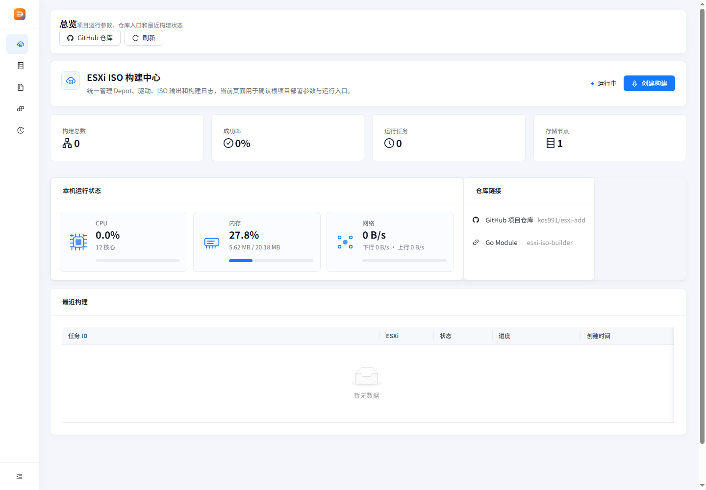
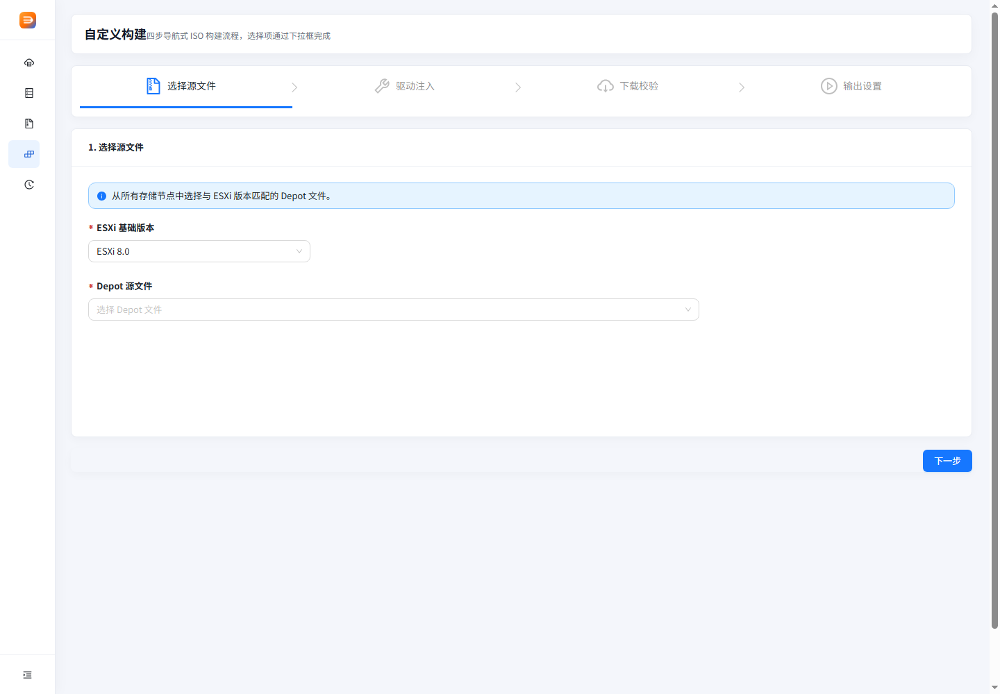
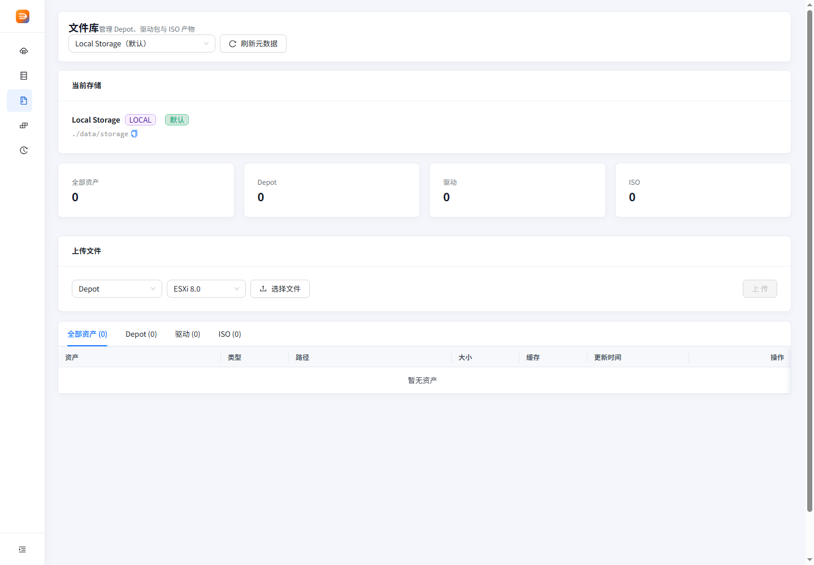

# ESXi ISO Builder

ESXi ISO Builder 是一个用于内网自动化构建 ESXi 自定义 ISO 的单容器平台。它提供文件管理、存储节点、构建向导、任务进度和实时日志，后端使用 Go，前端使用 React + Ant Design。

## 界面预览







## 功能

- 管理 Depot、驱动包和 ISO 构建产物。
- 支持本地存储和 S3/R2 兼容存储。
- 构建前下载并校验 Depot、ZIP、VIB 文件。
- 支持构建任务进度、日志、历史记录和产物下载。
- 支持 API Token、Worker Token 和可配置 CORS。

## 快速启动

```bash
docker-compose pull
docker-compose up -d
```

访问：

```text
http://localhost:8080
```

常用 `.env`：

```env
APP_IMAGE=ghcr.io/kos991/esxi-add:latest
APP_PORT=8080
SERVER_HOST=0.0.0.0
BUILD_MODE=local
WORKER_TOKEN=change-this-worker-token
```

## 本地开发

后端：

```bash
go test ./...
go run ./cmd/server
```

前端：

```bash
cd frontend
npm install
npm run dev
```

前端验证：

```bash
npm run test
npm run build
```

## 更多文档

- [使用说明](docs/usage.md)
- [部署说明](docs/deployment.md)
- [更新记录](CHANGELOG.md)
