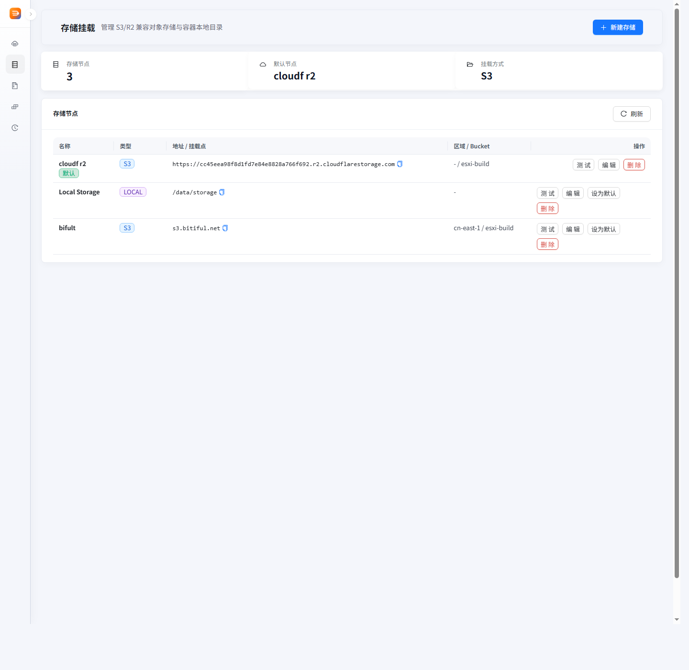
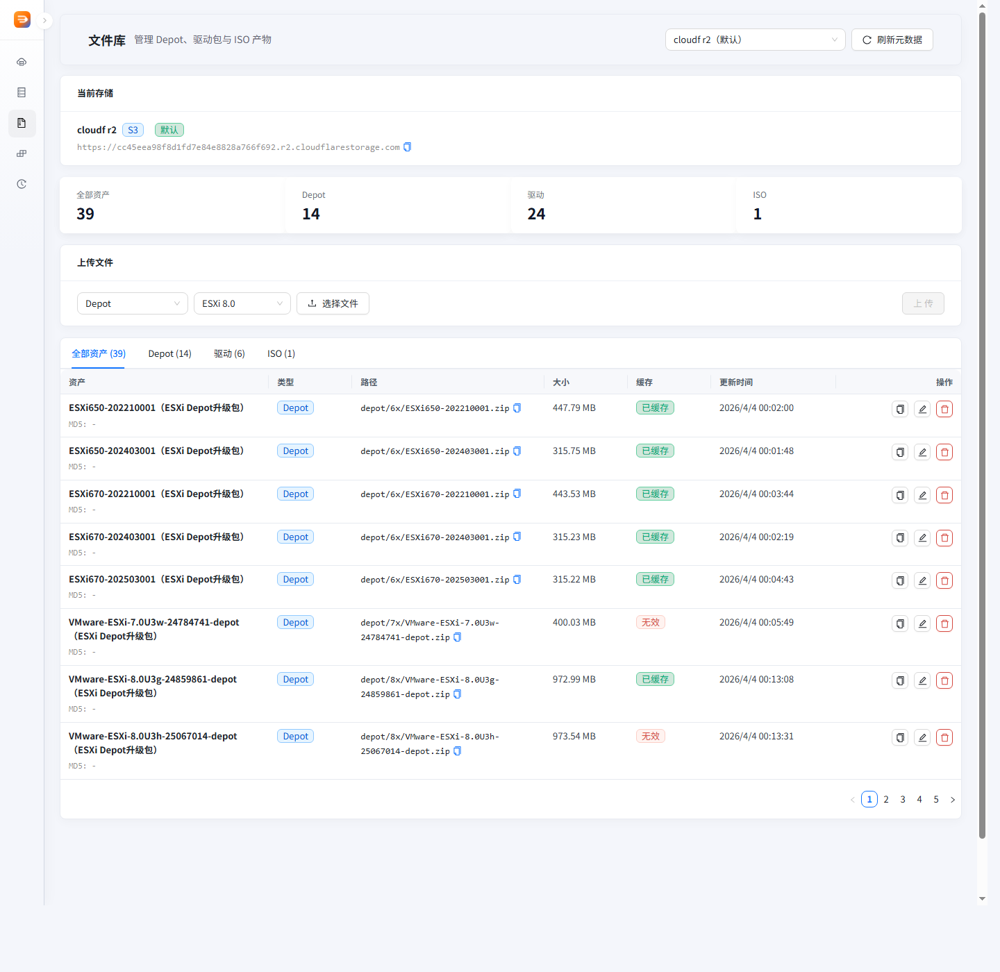
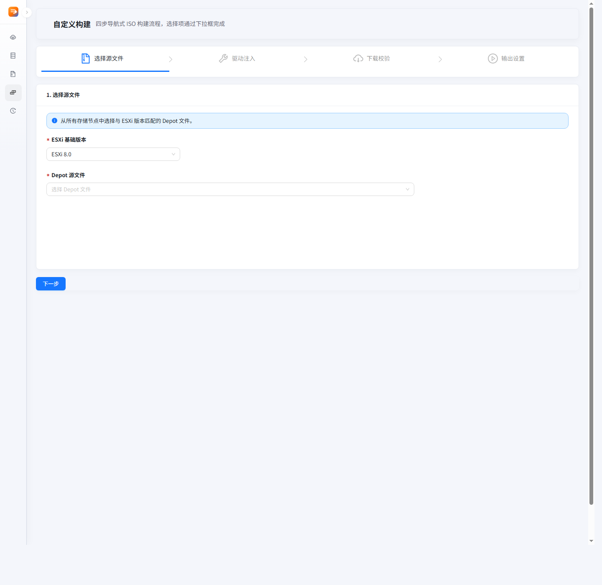

# ESXi ISO Builder

发布分支：`main`
源码分支：`dev`

这个分支只保留发布说明、Docker 镜像入口和界面截图。完整源码请切换到 `dev`。

## 启动

```bash
docker-compose pull
docker-compose up -d
```

默认访问：

```text
http://localhost:8080
```

## 镜像

- `Dockerfile`
- `docker-compose.yml`
- `docs/deployment.md`

## 截图






