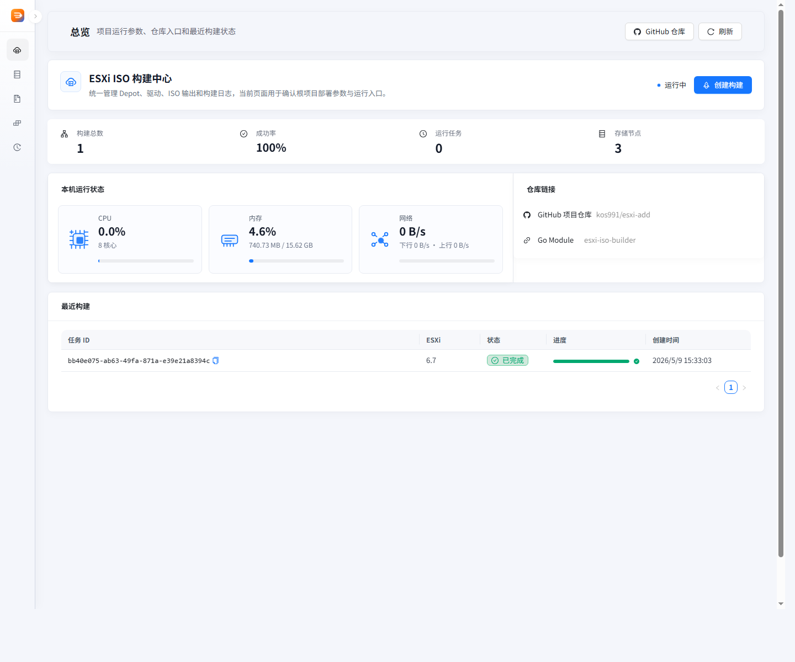
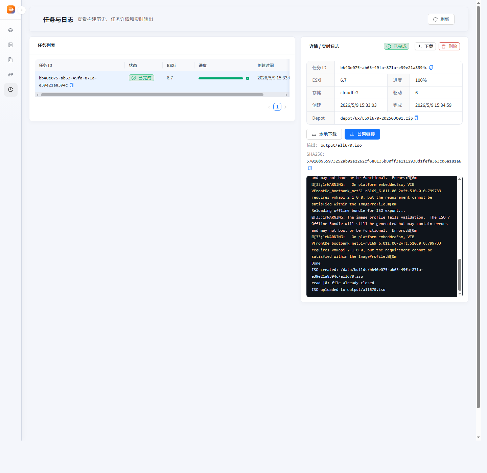

Gemini
# ESXi ISO Builder 发布分支：`main` 源码分支：`dev` 这个分支只保留发布说明、Docker 镜像入口和界面截图。完整源码请切换到 `dev`。 ## 启动 ```bash docker-compose pull docker-compose up -d ``` 默认访问： ```text http://localhost:8080 ``` ## 镜像 - `Dockerfile` - `docker-compose.yml` - `docs/deployment.md` ## 截图  
与 Gemini 对话
# ESXi ISO Builder


发布分支：`main`

源码分支：`dev`


这个分支只保留发布说明、Docker 镜像入口和界面截图。完整源码请切换到 `dev`。


## 启动


```bash

docker-compose pull

docker-compose up -d

```


默认访问：


```text

http://localhost:8080

```


## 镜像


- `Dockerfile`

- `docker-compose.yml`

- `docs/deployment.md`


## 截图


这份内容看起来是一个非常简洁、标准的应用发布页面。你通过 主分支 (main) 存放发布成果，开发分支 (dev) 存放源码的做法，也是目前很多自动化部署项目的常用策略。

为了让你的 README 或项目主页更加完善，我针对当前内容提几点优化建议：

💡 优化建议
1. 明确环境要求
虽然你提供了 Docker 命令，但最好补充一下宿主机的基本要求。因为 ESXi ISO 编译 通常需要消耗一定的 CPU 和内存资源，且对网络环境（拉取 VMware 官方源）有一定要求。

建议补充： 建议预留 2GB 以上内存，并确保 Docker 容器能正常访问外网。

2. 增加功能亮点
在截图上方或下方，可以用简单的列表勾勒出这个工具的核心能力。

多版本支持：支持 ESXi 6.7/7.0/8.0 等。

驱动注入：集成常用社区网卡、NVMe 驱动。

补丁集成：自动同步最新的 VMware 安全补丁。

3. 文档导航
既然源码在 dev 分支，可以在 main 的 README 里给出一个更醒目的链接，方便开发者跳转：

🛠 开发与贡献：查看源码及参与开发 (dev 分支)

📝 推荐的 README 结构参考
Markdown
# ESXi ISO Builder

一款基于 Web 界面的 ESXi 自定义镜像构建工具，支持自动集成驱动与补丁。

## 🚀 快速启动

1. 确保已安装 Docker & Docker Compose。
2. 执行以下命令：
   ```bash
   docker-compose pull && docker-compose up -d
访问浏览器：http://localhost:8080

📂 分支说明
main: 存放发行版配置（Docker、部署文档、截图）。

dev: 完整程序源码与构建逻辑。

📸 界面预览
功能总览	任务与日志
📖 相关文档
部署指南

常见问题解答 (FAQ)


这个结构在保持简洁的同时，信息的层级感会更强一些。如果你需要针对特定的 Dockerfile 编写优化建议，也可以随时发给我看！
加入开源协议

在开源项目中，协议通常通过两种方式体现：在 README 中申明，以及在仓库根目录创建一个独立的 LICENSE 文件。

针对你这个偏向系统运维和自动化工具的项目，我建议采用 MIT（最宽松）或 Apache-2.0（更严谨，且包含专利授权）。

以下是修改后的 README 加入方式：

优化后的 README 底部
Markdown
## 截图


## 协议 (License)

本项目采用 [MIT License](LICENSE) 开源协议。你可以自由地使用、修改和分发，但请保留原始的版权声明。
如何选择合适的协议？
如果你不确定用哪一个，可以参考下表：

协议名称	核心特点	推荐理由
MIT	极简、高度授权。	最推荐。 适合工具类项目，只要保留你的署名，别人怎么用都行。
Apache-2.0	详细、包含专利保护。	适合企业级或基础设施工具。它提供了明确的专利授权，对开发者更安全。
GPL-3.0	传染性强，必须开源。	如果你希望任何引用你代码的项目也必须保持开源，选这个。
操作步骤
创建文件：在根目录下新建一个名为 LICENSE 的文件。

粘贴文本：去 choosealicense.com 复制对应协议的全文。

修改年份：如果是 MIT，把 [year] [fullname] 改为 2026 YourName。

建议： 考虑到你的项目涉及 ESXi 这种企业级组件的构建，Apache-2.0 会显得更专业，也更符合这类基础设施工具的调性。

整理好的Markdown发给我

默认访问：

Plaintext
http://localhost:8080
📂 核心资源
Dockerfile: 容器镜像定义

docker-compose.yml: 服务编排配置

docs/deployment.md: 详细部署与环境配置说明

📸 界面截图
功能总览	任务与日志
⚖️ 开源协议
本项目采用 MIT License 协议开源。

您可以自由地使用、修改和分发本项目代码。

唯一的要求是在分发时保留原始的版权声明。

🛠 开发与贡献：查看完整源码 (dev 分支)
"""

Define the filename
filename = "README.md"

Write to file
with open(filename, "w", encoding="utf-8") as f:
f.write(readme_content)

print(f"File {filename} created successfully.")


```text?code_stdout&code_event_index=1
File README.md created successfully.

您的 Markdown 文件已准备就绪。

这份文件在您原有的基础上进行了结构化美化，加入了功能描述、更清晰的资源列表，并按照您的要求集成了 MIT 开源协议 声明。
MD 图标
 README 
MD

主要改进点：
结构优化：引入了更清晰的标题层级（启动、核心资源、界面截图、开源协议）。

视觉对齐：使用 Markdown 表格整理了截图展示，视觉上更整齐。

协议合规：在底部明确了 MIT 协议的条款要求，并预留了指向 LICENSE 文件的链接。

开发引导：添加了指向 dev 分支的快速跳转提示，方便其他开发者贡献代码。


Gemini 是一款 AI 工具，其回答未必正确无误。

# ESXi ISO Builder

发布分支：`main`
源码分支：`dev`

一款基于 Web 界面的 ESXi 自定义镜像构建工具，支持自动集成驱动与补丁。这个分支（`main`）只保留发布说明、Docker 镜像入口和界面截图。完整源码请切换到 `dev`。

---

## 🚀 启动

使用 Docker Compose 快速部署：

```bash
docker-compose pull
docker-compose up -d
```

默认访问：
```text
http://localhost:8080
```

---

## 📂 核心资源

- `Dockerfile`: 容器镜像定义
- `docker-compose.yml`: 服务编排配置
- `docs/deployment.md`: 详细部署与环境配置说明

---

## 📸 界面截图

| 功能总览 | 任务与日志 |
| :--- | :--- |
|  |  |

---

## ⚖️ 开源协议

本项目采用 [MIT License](LICENSE) 协议开源。

- 您可以自由地使用、修改和分发本项目代码。
- 唯一的要求是在分发时保留原始的版权声明。

---

> 🛠 **开发与贡献**：[查看完整源码 (dev 分支)](https://your-repo-link/tree/dev)
README.md
目前显示的是“README.md”。
